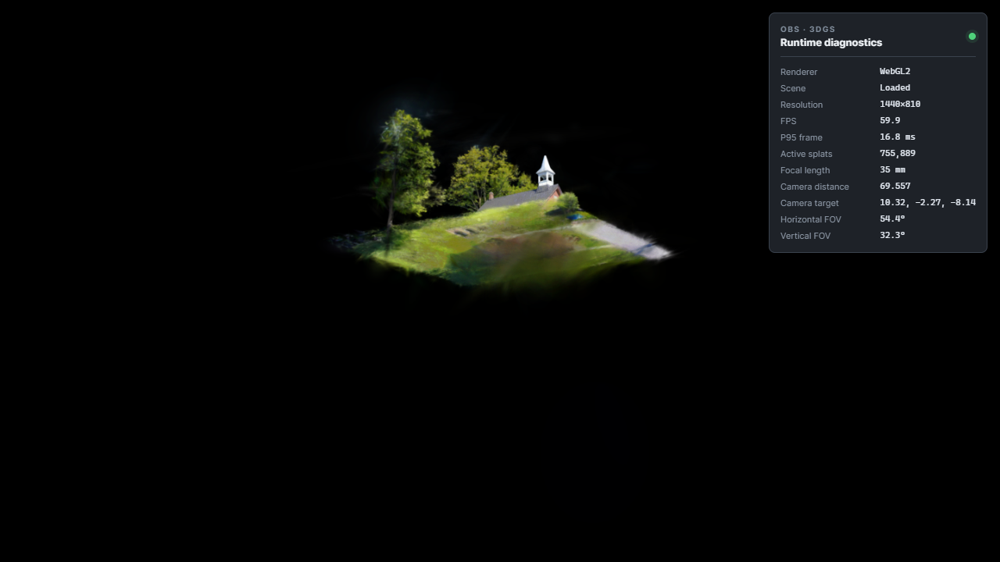

<!-- SPDX-License-Identifier: GPL-2.0-or-later -->

# Windows Web renderer preflight — 2026-09-03

[简体中文](2026-09-03-windows-web-preflight.zh-CN.md)

This is evidence for the Spark/WebGL renderer only. It is not an OBS recording benchmark and does not satisfy the Windows release gate.

| Item | Value |
|---|---|
| Scene | Knock Community Hall by scbenoit, CC BY 4.0 |
| Fixture SHA-256 | `5931c2b44710aa1d42a48f89b6b4546108430b16700b8eb5a656f8a55f25227a` |
| Source splats | 1,935,275 |
| Active LOD splats | 755,889 |
| GPU | NVIDIA GeForce RTX 4090 |
| Logical output | 1920×1080 |
| Internal render size | 1440×810 (75%) |
| Quality | Balanced, LOD 1M, SH2, target 60 FPS |
| Camera | 35 mm, yaw 35°, pitch −12°, distance 69.557 |
| Camera target | 10.318, −2.270, −8.136 |
| Observed FPS | 59.9 |
| P95 frame interval | 16.8 ms |
| Settled scheduling | `renderScheduled=false` after Spark dirty work completed |

The same run checked optical zoom, orbit/pan/dolly interaction, monotonic protocol revisions, live-lock blocking, preset-only lock bypass, LOD reload with camera preservation, and eventual on-demand idle. Required follow-up is a 30-minute OBS 1080p60 recording with OBS render-delay statistics.
