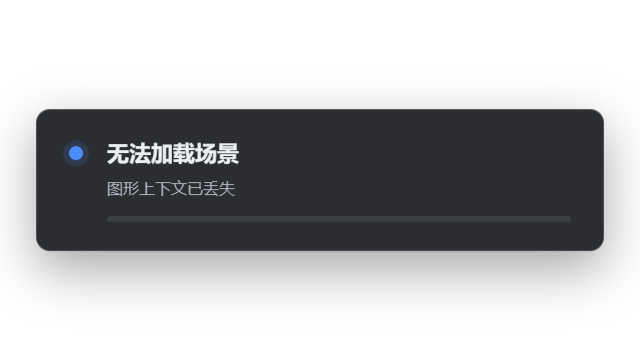

# Source restoration and WebGL recovery

Environment: isolated OBS 32.2.2 on Windows 11, RTX 4090, current candidate plugin/runtime.

`tests/e2e/obs-source-restoration.lua` alternates real `obs_save_source`, removal and `obs_load_source` calls across video ticks. All 100 restorations preserved UUID, focal length, exposure, normalized angle, live lock, preset JSON and private navigation state. [Report](data/2026-09-04-source-restoration.json). This covers the source persistence API; collection save/reopen/relink and actual frontend clicks are tracked separately.

`npm run test:obs:context` uses the standard `WEBGL_lose_context` extension on a dedicated 640×360 grid source. The first loss displayed recovery status and automatically reloaded once; the restored PNG hash matched the original. A second loss/restoration produced a stable error without another reload. OBS remained responsive and the test source was removed. [Settings and report](data/2026-09-04-context-recovery.json).

This is a real CEF context lifecycle test, not a physical GPU-disconnect or driver-reset test. Set the local WebSocket password and log path through the environment. Enable CEF debugging only for the isolated test instance. Create `output/obs-source-restoration/` before loading the Lua script. Save the cleaned collection through OBS and remove the test script before shutting down so asynchronous saving cannot restore temporary sources.
