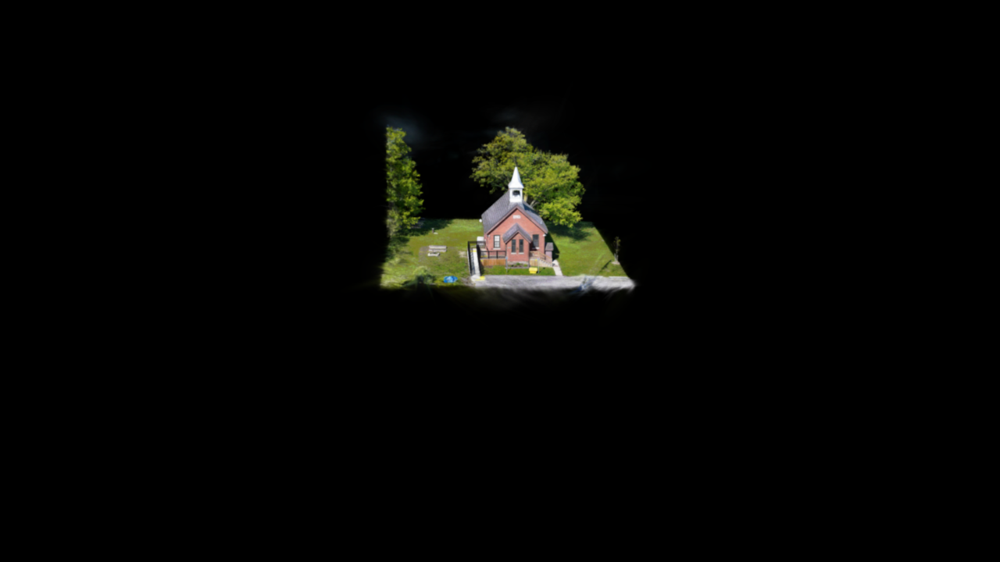
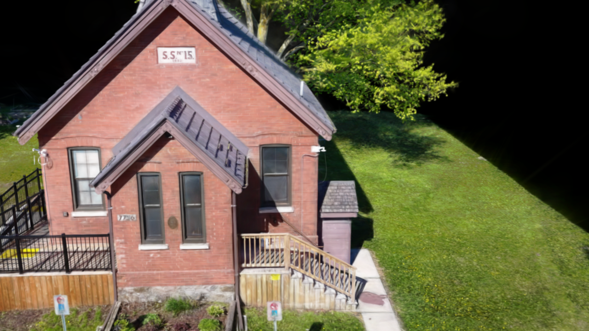

# Windows CEF frame and recording validation (2026-09-04)

Actual render-callback RAF timestamps are captured separately from CPU submission durations. Frame-interval P95 uses nearest-rank over all raw intervals. CPU submission is not GPU execution time, and the P95 of sampled OBS compositor averages is not used as a frame P95.

Environment: Windows 10.0.26200, OBS 32.2.2, RTX 4090, Spark 2.1.0, Three.js 0.180.0. The CC BY 4.0 Knock Community Hall fixture has SHA-256 `5931c2b44710aa1d42a48f89b6b4546108430b16700b8eb5a656f8a55f25227a`. Output is 1920×1080/60, internal raster 1440×810, 1M LOD, SH2 and 35 mm. Native camera yaw follows a ±10° sinusoid at 20 updates per second.

| Wide-view measurement | Result |
|---|---:|
| Render capture | 1,800 seconds |
| Recording timestamps | 1,801.383 seconds |
| Frame intervals | 108,004 |
| Average FPS | 60.0024 |
| Interval P95 / maximum | 16.7 / 16.8 ms |
| CPU submission P95 / maximum | 0.4 / 3.5 ms |
| OBS render skips | 0 / 108,010 |
| MKV bytes | 202,118,724 |

The ten-second idle observation had no added renders or sorts. [Full report](data/2026-09-04-renderer-30m.json), [raw frame data](data/2026-09-04-renderer-30m-frames.json.gz). The recorded distance is 358.157 and the subject occupies a small part of the frame; this is a wide-view workload, not evidence for every viewpoint or scene.



A separate [close camera](data/knock-community-hall-close-camera.json) uses target (79.7397, 10.7020, -47.7562), yaw 83.45°, pitch 16°, distance 36.5913 and 35 mm; scene scale is 4.99 and Y rotation -3.7°.

The close-view gate passed: 1,800 seconds of capture and 1,801.299 seconds of recording, 108,004 intervals, **60.0024 FPS**, **16.7 ms P95**, 16.8 ms maximum and **0 / 108,009** OBS render skips. CPU submission P95 was 0.4 ms, maximum 5.8 ms. The MKV is 1,549,829,428 bytes. Capture did not overflow and static caching passed.

[Close-view report](data/2026-09-04-renderer-close-30m.json), [raw frames](data/2026-09-04-renderer-close-30m-frames.json.gz). The gate verifies the GPU, actual internal raster, numeric quality profile, recording length and raw-frame coverage.



```text
npm run test:obs:renderer -- --duration-seconds 1800 --record true --pose docs/benchmarks/data/knock-community-hall-close-camera.json --output output/obs-renderer-close-30m
```

The dedicated OBS instance's global audio inputs are muted during recording; camera, recording path and mute states are restored afterward. Recordings are excluded from release ZIPs. M1 and RTX 4060 require separate device evidence; see [manual acceptance](../manual-acceptance.md).
